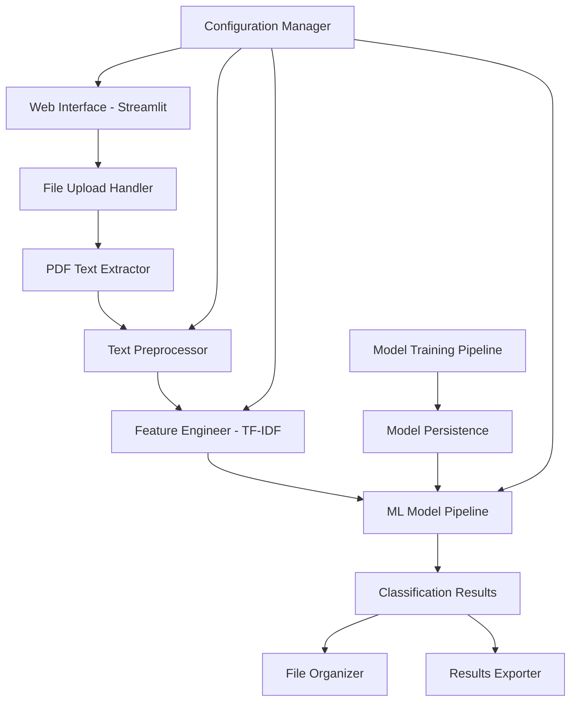

# Design Document

## Overview

The Automated Resume Classification System is designed as a modular, production-ready application that combines Natural Language Processing, Machine Learning, and web technologies to automatically categorize resumes. The system follows a pipeline architecture with clear separation of concerns: data preprocessing, feature engineering, model training/inference, and user interface layers.

The architecture supports both batch processing and real-time classification, with persistent model storage and comprehensive error handling throughout the pipeline.

## Architecture

### High-Level Architecture



### System Components

1. **Web Application Layer**: Streamlit-based user interface
2. **Data Processing Layer**: PDF extraction and text preprocessing
3. **Feature Engineering Layer**: TF-IDF vectorization and feature extraction
4. **Machine Learning Layer**: Model training, evaluation, and inference
5. **Storage Layer**: Model persistence and file organization
6. **Configuration Layer**: System settings and category management

## Components and Interfaces

### 1. Web Application Component (`src/web_app.py`)

**Purpose**: Provides the user interface and orchestrates the entire classification pipeline.

**Key Functions**:
- `main()`: Entry point for Streamlit application
- `upload_files()`: Handle multiple PDF file uploads with drag-and-drop
- `display_progress()`: Show real-time processing progress
- `display_results()`: Present classification results with confidence scores
- `export_results()`: Generate CSV exports of classification results

**Interfaces**:
- Input: PDF files via Streamlit file uploader
- Output: Web interface with results and organized files

### 2. PDF Text Extraction Component (`src/utils.py`)

**Purpose**: Extract text content from PDF files with error handling.

**Key Functions**:
- `extract_text_from_pdf(file_path: str) -> str`: Extract text using PyPDF2
- `batch_extract_texts(file_paths: List[str]) -> Dict[str, str]`: Process multiple PDFs
- `validate_pdf_format(file_path: str) -> bool`: Verify PDF file integrity

**Interfaces**:
- Input: PDF file paths
- Output: Extracted text strings with metadata

### 3. Text Preprocessing Component (`src/data_preprocessing.py`)

**Purpose**: Clean and normalize text data for machine learning processing.

**Key Functions**:
- `clean_text(text: str) -> str`: Master cleaning function
- `remove_urls(text: str) -> str`: Remove URL patterns using regex
- `remove_emails_phones(text: str) -> str`: Strip contact information
- `remove_special_chars(text: str) -> str`: Clean special characters
- `remove_stop_words(text: str) -> str`: Filter stop words using NLTK
- `normalize_text(text: str) -> str`: Convert to lowercase and handle encoding

**Interfaces**:
- Input: Raw text strings
- Output: Cleaned, normalized text ready for vectorization

### 4. Feature Engineering Component (`src/feature_engineering.py`)

**Purpose**: Convert text data into numerical features using TF-IDF vectorization.

**Key Functions**:
- `create_tfidf_vectorizer() -> TfidfVectorizer`: Initialize vectorizer with optimal parameters
- `fit_vectorizer(texts: List[str]) -> TfidfVectorizer`: Train vectorizer on text corpus
- `transform_texts(texts: List[str], vectorizer: TfidfVectorizer) -> scipy.sparse.matrix`: Convert texts to feature vectors
- `save_vectorizer(vectorizer: TfidfVectorizer, path: str)`: Persist trained vectorizer
- `load_vectorizer(path: str) -> TfidfVectorizer`: Load saved vectorizer

**Configuration**:
- Max features: 5000
- N-gram range: (1, 2)
- Min document frequency: 2
- Max document frequency: 0.95

**Interfaces**:
- Input: Preprocessed text strings
- Output: Sparse feature matrices for ML models

### 5. Machine Learning Pipeline Component (`src/model_training.py`)

**Purpose**: Train, evaluate, and select the best performing classification model.

**Key Functions**:
- `train_multiple_models(X_train, y_train) -> Dict[str, Any]`: Train all ML algorithms
- `evaluate_models(models: Dict, X_test, y_test) -> Dict[str, Dict]`: Comprehensive evaluation
- `select_best_model(evaluation_results: Dict) -> Tuple[str, Any]`: Choose optimal model
- `save_best_model(model: Any, model_name: str, path: str)`: Persist trained model
- `load_model(path: str) -> Any`: Load saved model for inference

**Supported Algorithms**:
- K-Nearest Neighbors (KNN)
- Logistic Regression with L2 regularization
- Random Forest with feature importance
- Support Vector Machine (SVM) with RBF kernel
- Multinomial Naive Bayes
- OneVsRest multiclass wrapper

**Evaluation Metrics**:
- Accuracy, Precision, Recall, F1-score
- Confusion matrix visualization
- Classification reports
- Cross-validation scores

**Interfaces**:
- Input: Feature vectors and labels
- Output: Trained models with performance metrics

### 6. Classification Service Component (`src/utils.py`)

**Purpose**: Perform real-time classification of new resumes using trained models.

**Key Functions**:
- `classify_resume(text: str, model: Any, vectorizer: TfidfVectorizer) -> Tuple[str, float]`: Single resume classification
- `batch_classify(texts: List[str], model: Any, vectorizer: TfidfVectorizer) -> List[Tuple[str, float]]`: Batch processing
- `get_category_mapping() -> Dict[int, str]`: Load category labels
- `organize_files_by_category(results: List, source_files: List[str])`: Automated file organization

**Interfaces**:
- Input: New resume texts
- Output: Category predictions with confidence scores

## Data Models

### 1. Resume Data Model

```python
@dataclass
class ResumeData:
    filename: str
    raw_text: str
    cleaned_text: str
    predicted_category: str
    confidence_score: float
    processing_time: float
    error_message: Optional[str] = None
```

### 2. Model Performance Model

```python
@dataclass
class ModelPerformance:
    model_name: str
    accuracy: float
    precision: float
    recall: float
    f1_score: float
    confusion_matrix: np.ndarray
    cross_val_scores: List[float]
    training_time: float
```

### 3. Classification Result Model

```python
@dataclass
class ClassificationResult:
    resume_filename: str
    predicted_category: str
    confidence_score: float
    all_probabilities: Dict[str, float]
    processing_timestamp: datetime
```

### 4. Category Mapping Model

```python
CATEGORY_MAPPING = {
    0: "ACCOUNTANT",
    1: "ADVOCATE",
    2: "AGRICULTURE",
    3: "APPAREL",
    4: "ARTS",
    5: "AUTOMOBILE",
    6: "AVIATION",
    7: "BANKING",
    8: "BPO",
    9: "BUSINESS-DEVELOPMENT",
    10: "CHEF",
    11: "CONSTRUCTION",
    12: "CONSULTANT",
    13: "DESIGNER",
    14: "DIGITAL-MEDIA",
    15: "ENGINEERING",
    16: "FINANCE",
    17: "FITNESS",
    18: "HEALTHCARE",
    19: "HR",
    20: "INFORMATION-TECHNOLOGY",
    21: "PUBLIC-RELATIONS",
    22: "SALES",
    23: "TEACHER"
}
```

## Error Handling

### 1. File Processing Errors

- **PDF Corruption**: Graceful handling with error logging and user notification
- **Encoding Issues**: Automatic encoding detection and fallback mechanisms
- **Large File Handling**: Memory management and processing timeouts
- **Invalid File Formats**: Format validation with clear error messages

### 2. Model Inference Errors

- **Model Loading Failures**: Fallback to default model with user notification
- **Vectorizer Compatibility**: Version checking and automatic retraining if needed
- **Memory Constraints**: Batch size optimization and memory monitoring
- **Prediction Failures**: Individual resume error isolation in batch processing

### 3. Web Application Errors

- **Upload Failures**: Retry mechanisms and progress recovery
- **Session Management**: State persistence across user interactions
- **Export Errors**: Alternative format options and partial result exports
- **UI Responsiveness**: Asynchronous processing with progress indicators

### Error Logging Strategy

```python
import logging

# Configure comprehensive logging
logging.basicConfig(
    level=logging.INFO,
    format='%(asctime)s - %(name)s - %(levelname)s - %(message)s',
    handlers=[
        logging.FileHandler('logs/resume_classifier.log'),
        logging.StreamHandler()
    ]
)
```

## Testing Strategy

### 1. Unit Testing

**Test Coverage Areas**:
- Text preprocessing functions with various input formats
- TF-IDF vectorization with edge cases
- Model training and evaluation pipelines
- PDF text extraction with different file types
- Classification accuracy with known test cases

**Test Framework**: pytest with fixtures for sample data

### 2. Integration Testing

**Test Scenarios**:
- End-to-end pipeline from PDF upload to classification
- Model persistence and loading workflows
- Web interface functionality with simulated user interactions
- Batch processing with various file sizes and formats
- Error handling across all system components

### 3. Performance Testing

**Metrics to Validate**:
- Processing time: <5 seconds per resume
- Memory usage: <2GB for batch processing
- Classification accuracy: >90% on test dataset
- Concurrent user handling in web interface
- Model loading and inference speed

### 4. Data Quality Testing

**Validation Checks**:
- Text extraction accuracy from various PDF formats
- Preprocessing consistency across different text inputs
- Feature vector dimensionality and sparsity
- Category distribution balance in training data
- Model generalization on unseen resume formats

## Performance Optimization

### 1. Text Processing Optimization

- **Vectorized Operations**: Use NumPy and pandas for batch text processing
- **Regex Compilation**: Pre-compile regex patterns for repeated use
- **Memory Management**: Process large batches in chunks to manage memory
- **Caching**: Cache preprocessed texts for repeated operations

### 2. Model Inference Optimization

- **Model Loading**: Load models once at application startup
- **Batch Prediction**: Process multiple resumes simultaneously
- **Feature Caching**: Cache TF-IDF vectors for repeated classifications
- **Parallel Processing**: Use multiprocessing for CPU-intensive operations

### 3. Web Application Optimization

- **Asynchronous Processing**: Use Streamlit's async capabilities for file processing
- **Progress Tracking**: Implement granular progress updates for user feedback
- **Result Caching**: Cache classification results for session persistence
- **File Streaming**: Stream large file uploads to prevent memory issues

## Security Considerations

### 1. File Upload Security

- **File Type Validation**: Strict PDF format checking
- **File Size Limits**: Maximum upload size restrictions
- **Malware Scanning**: Basic file content validation
- **Temporary File Cleanup**: Automatic cleanup of uploaded files

### 2. Data Privacy

- **Text Content**: No persistent storage of resume content
- **User Sessions**: Isolated processing environments
- **Export Security**: Secure CSV generation and download
- **Logging Privacy**: Anonymized error logging without personal data

### 3. Model Security

- **Model Integrity**: Checksum validation for saved models
- **Access Control**: Restricted access to model files
- **Version Control**: Model versioning and rollback capabilities
- **Input Validation**: Sanitization of text inputs before processing